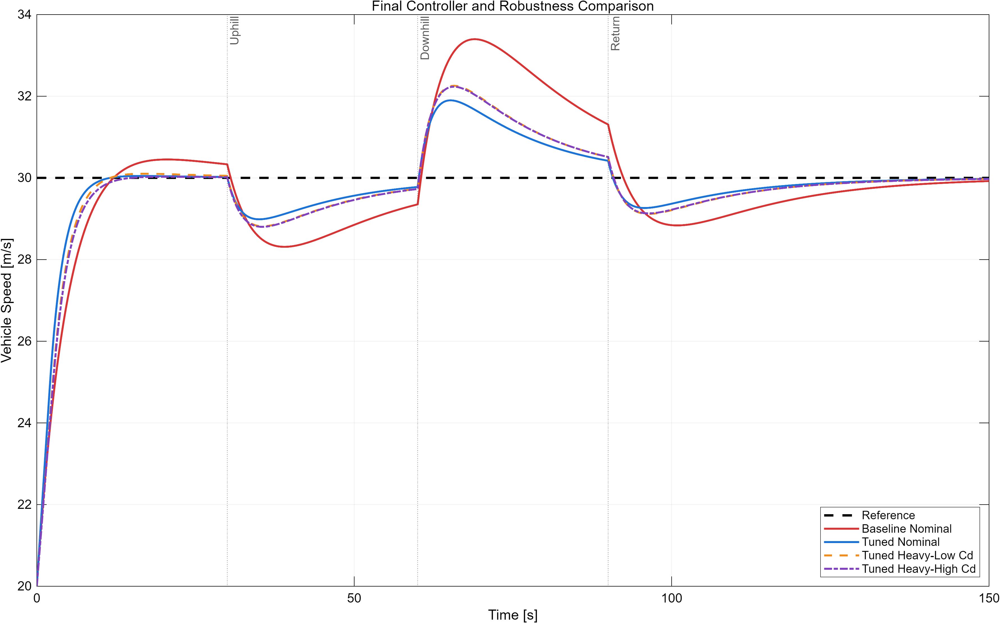
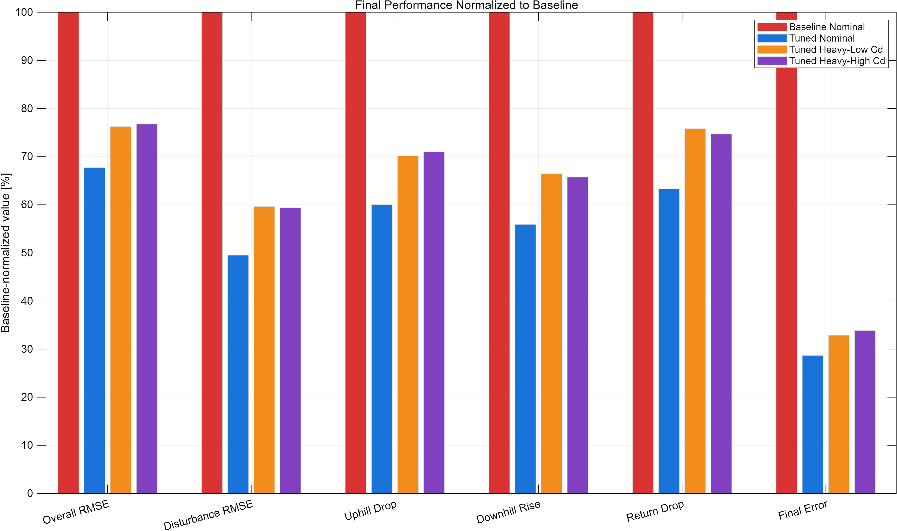
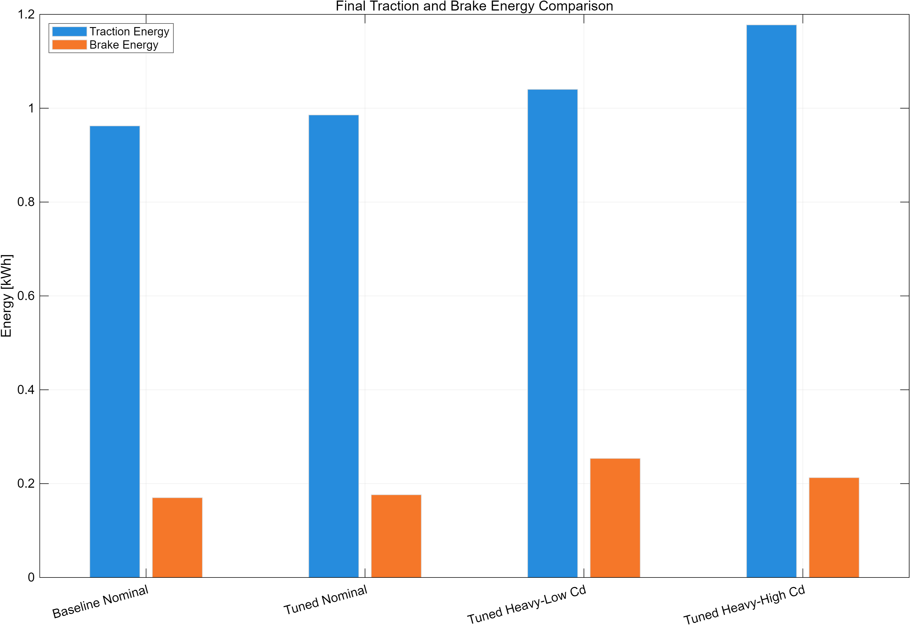

# Week 8 Final Engineering Report

## 차량 정속주행 제어기의 설계, 성능 개선 및 강건성 검증

## 1. 보고서 개요

본 프로젝트는 MATLAB과 Simulink를 사용해 차량 종방향 동역학을 모델링하고, PID 기반 Cruise Control을 설계한 뒤 실제 주행에서 발생할 수 있는 물리적 제약과 외란에 대해 성능을 검증한 8주간의 engineering study이다.

프로젝트의 출발점은 단순했다. 일정한 구동력을 입력했을 때 차량 속도가 어떻게 변하는지를 계산하고, 같은 모델을 Simulink로 재현했다. 그러나 평지에서 목표속도를 추종한다는 사실만으로는 제어기의 성능을 설명할 수 없었다. 이에 구동력 제한, 경사 변화, 차량 질량, 공기저항계수와 같은 조건을 순차적으로 추가하고, 성능이 저하되는 조건을 직접 찾아 원인을 분석했다.

가장 중요한 전환점은 ±5° 복합 경사 시험이었다. 기본 제어기는 오르막에서 크게 감속하고 내리막에서 과속했지만, 측정된 구동·제동 요구량은 4000 N 한계보다 훨씬 낮았다. 이 근거로 액추에이터 용량보다 제어기 게인과 과도응답이 문제라고 판단했고, 제어기를 단계적으로 튜닝했다. 최종 제어기는 기본 제어기 대비 외란 RMSE를 50.5%, 초기 오버슈트를 89.5%, 최종오차를 71.3% 감소시켰다.

이 보고서는 결과 그래프를 나열하는 데 그치지 않고 다음 네 가지 연구 질문에 답한다.

1. 평지에서 목표속도를 맞춘 제어기는 외란에서도 충분히 좋은가?
2. ±5° 경사에서 발생한 큰 속도편차의 원인은 4000 N 액추에이터 한계인가, 제어기 동특성인가?
3. 액추에이터 요구량을 늘리지 않고 PID 튜닝만으로 성능을 얼마나 개선할 수 있는가?
4. 명목 조건에서 얻은 개선은 질량·공기저항 변화에서도 유지되며, 에너지에는 어떤 대가가 생기는가?

## 2. 프로젝트의 맥락과 의미

이 프로젝트는 학부 2학년 1학기를 마친 여름방학 동안 진행했다. 수업에서 접한 운동방정식과 PID 개념을 따라 구현하는 수준에서 시작했지만, 주차가 진행될수록 스스로 질문을 만들고 비교 실험을 설계하는 방향으로 확장했다.

- 평지 추종 성공이 외란 성능까지 보장하는가?
- 관찰된 성능 저하를 하드웨어 한계와 제어기 동특성 중 어느 쪽으로 설명할 수 있는가?
- 통제된 게인 실험으로 성능을 개선하면서 액추에이터 여유를 유지할 수 있는가?
- 개선된 설계가 차량 파라미터 변화에서도 유효하며, 그때의 에너지 트레이드오프는 무엇인가?

질문을 시뮬레이션 입력과 파라미터로 변환했고, 결과는 속도 그래프뿐 아니라 RMSE, 최대 편차, 최종오차, 액추에이터 요구량과 에너지로 정량화했다. 질량 20% 증가, `Cd=0.24–0.36`, 갑작스러운 경사 변화와 4000 N 제한은 이 연구 질문들에 답하기 위한 실험 변수였다. 이 과정이 프로젝트를 단순 재현에서 engineering study로 바꾼 핵심이다.

취업 포트폴리오 관점에서 이 프로젝트가 보여 주는 것은 특정 툴의 사용법만이 아니다. 물리 모델을 검증하고, 실패 조건을 찾고, 로그를 통해 원인을 분리하고, 통제된 실험으로 설계 변경의 효과를 입증하는 일련의 문제 해결 과정이다.

## 3. 시스템 모델

### 3.1 차량 종방향 동역학

차량 속도는 다음 운동방정식으로 계산했다.

$$
m\dot{v}=F_{\mathrm{throttle}}-F_{\mathrm{brake}}-F_{\mathrm{aero}}-F_{\mathrm{roll}}-F_{\mathrm{grade}}
$$

각 저항력은 다음과 같다.

$$
F_{\mathrm{aero}}=\frac{1}{2}\rho C_d A v^2
$$

$$
F_{\mathrm{roll}}=C_{rr}mg
$$

$$
F_{\mathrm{grade}}=mg\sin\theta
$$

기준 차량 파라미터는 다음과 같다.

| 항목 | 값 |
|---|---:|
| 초기속도 | 20 m/s |
| 목표속도 | 30 m/s |
| 차량 질량 | 1500 kg |
| 공기저항계수 | 0.30 |
| 전면 투영면적 | 2.2 m² |
| 구름저항계수 | 0.015 |
| 공기 밀도 | 1.225 kg/m³ |
| 중력가속도 | 9.81 m/s² |

### 3.2 제어기와 액추에이터

속도오차 $e=v_{ref}-v$를 PID 제어기에 입력해 제어력 $F_{control}$을 계산했다.

$$
F_{control}=K_pe+K_i\int e\,dt+K_d\frac{de}{dt}
$$

제어력의 부호에 따라 스로틀과 브레이크를 분리했다.

$$
F_{\mathrm{throttle}}=\max(F_{control},0)
$$

$$
F_{\mathrm{brake}}=\max(-F_{control},0)
$$

제어력은 ±4000 N 범위로 제한했다. 포화 상태에서 적분값이 계속 누적되는 windup을 방지하기 위해 PID 내부 출력 제한과 anti-windup clamping을 적용했다.

비교한 최종 게인은 다음과 같다.

| 제어기 | $K_p$ | $K_i$ | $K_d$ |
|---|---:|---:|---:|
| 기본 PID | 500 | 25 | 500 |
| 튜닝 PID | 1000 | 60 | 500 |

## 4. 시험 설계와 KPI

### 4.1 경사 외란 시나리오

하나의 150초 시뮬레이션에 가속, 오르막, 내리막, 평지 복귀를 모두 포함했다.

| 구간 | 경사 | 목적 |
|---:|---:|---|
| 0–30 s | 0° | 초기 목표속도 추종 성능 |
| 30–60 s | +5° | 오르막 외란에 대한 구동·회복 성능 |
| 60–90 s | −5° | 내리막 과속 억제와 제동 전환 성능 |
| 90–150 s | 0° | 외란 제거 후 재수렴 성능 |

60초에는 경사가 +5°에서 −5°로 총 10°만큼 갑자기 변한다. 이 조건은 제어기의 구동→제동 전환과 적분 상태의 영향을 확인하기 위해 의도적으로 사용했다.

### 4.2 최종 비교 조건

| 조건 | 제어기 | 질량 | $C_d$ | 의미 |
|---|---|---:|---:|---|
| Baseline Nominal | 기본 | 1500 kg | 0.30 | 개선 전 기준 |
| Tuned Nominal | 튜닝 | 1500 kg | 0.30 | 동일 차량에서 순수 튜닝 효과 |
| Tuned Heavy-Low Cd | 튜닝 | 1800 kg | 0.24 | 큰 관성·작은 자연감속, 제동 관점의 가혹 조건 |
| Tuned Heavy-High Cd | 튜닝 | 1800 kg | 0.36 | 큰 관성·큰 주행저항, 구동·에너지 관점의 가혹 조건 |

### 4.3 KPI 정의

| KPI | 해석 |
|---|---|
| Time to 99% | 목표속도의 99%에 처음 도달한 시간 |
| Startup overshoot | 0–30초 구간의 최대 목표속도 초과량 |
| Overall RMSE | 0–150초 전체의 대표 추종오차 |
| Disturbance RMSE | 30초 이후 외란 구간의 대표 추종오차 |
| Overall MAE | 전체 구간 절대오차의 시간평균 |
| IAE | 150초 동안 누적된 절대오차 |
| Uphill drop | 오르막에서의 최대 속도 저하량 |
| Downhill rise | 내리막에서의 최대 초과속도 |
| Return drop | 평지 복귀 후 최대 속도 저하량 |
| Final error | 150초 시점의 절대 속도오차 |

Simulink 가변 스텝 솔버의 데이터는 시간 간격이 일정하지 않다. 따라서 RMSE와 MAE는 단순 표본 평균 대신 실제 시간 간격을 반영하는 수치적분으로 계산했다.

$$
RMSE=\sqrt{\frac{1}{T}\int_0^T e(t)^2\,dt}
$$

이 변경은 서로 다른 모델과 조건을 같은 기준으로 비교하기 위해 필요했다.

## 5. 문제 발견과 원인 분석

### 5.1 기능적으로 정상인 제어기에서 드러난 성능 저하

기본 제어기는 평지에서 목표속도 30 m/s 부근으로 수렴했다. 그러나 복합 경사 시나리오를 적용하자 다음 문제가 나타났다.

| 관찰 항목 | 기본 제어기 결과 |
|---|---:|
| 오르막 최저속도 | 28.313 m/s |
| 내리막 최고속도 | 33.397 m/s |
| 평지 복귀 후 최저속도 | 28.837 m/s |
| 외란 RMSE | 1.4726 m/s |
| 최종오차 | 0.07783 m/s |

오르막에서는 목표보다 1.687 m/s 낮아졌고, 내리막에서는 3.397 m/s 높아졌다. 평지에서 목표속도에 도달한다는 사실만으로는 이 과도응답 문제를 알 수 없었다.

### 5.2 수치해석 오류처럼 보였던 물리 모델 오류

프로젝트 진행 중 Vehicle Plant의 Integrator에서 상태 도함수가 유한하지 않다는 오류가 발생하며 시뮬레이션이 중단됐다. 오류 메시지는 해의 특이점 가능성과 함께 고정 스텝 크기를 줄이거나 오차허용범위를 좁혀 더 작은 스텝을 사용해 보라고 안내했다. 처음에는 솔버가 빠른 상태변화를 충분히 따라가지 못한 문제일 수 있다고 판단해 수치해석 설정을 검토했다.

그러나 스텝 크기를 줄이는 것은 발산 시점을 더 세밀하게 계산할 뿐 근본 원인을 제거하지 못했다. 신호를 역추적한 결과, 속도가 음수가 된 뒤 공기저항 모델의 부호가 물리적으로 잘못 작동하고 있었다. 기존 식은 공기저항의 크기를 다음과 같이 계산해 순힘에서 항상 뺐다.

$$
F_{\mathrm{aero}}=k v^2, \qquad k=\frac{1}{2}\rho C_d A
$$

이 표현은 차량이 전진하는 $v\geq0$ 범위에서는 유효하다. 하지만 $v<0$이 되더라도 $v^2$은 양수이므로, 순힘에서 뺀 공기저항이 차량을 다시 정지 방향으로 밀지 않고 더 음의 방향으로 가속했다. 속도의 절댓값이 커질수록 잘못된 항력과 음의 가속도가 함께 커지며 다음과 같은 양의 피드백이 만들어졌다.

$$
v\downarrow \;\Rightarrow\; v^2\uparrow \;\Rightarrow\; \dot v\approx-\frac{k}{m}v^2\downarrow \;\Rightarrow\; v\text{가 더 빠르게 감소}
$$

이 미분방정식은 음의 속도 영역에서 유한 시간 안에 $-\infty$ 방향으로 발산할 수 있으므로, 결국 Integrator의 도함수가 Inf 또는 NaN이 되어 시뮬레이션이 중단됐다. 즉, 오류 메시지는 수치해석 문제처럼 보였지만 실제 원인은 운동 방향을 반영하지 않은 물리식이었다.

공기저항이 항상 운동 반대 방향으로 작용하도록 속도항을 부호가 보존되는 형태로 수정했다.

$$
F_{\mathrm{aero}}=k v|v|
$$

$v>0$이면 $v|v|>0$이므로 기존처럼 전진을 방해하고, $v<0$이면 $v|v|<0$이므로 순힘에서 이를 뺄 때 양의 방향 힘이 되어 후진 운동을 방해한다. 수정 후에는 음의 속도 영역에서도 항력이 올바른 방향으로 작용하고, Integrator 상태와 도함수가 유한한 범위에 유지되며 시뮬레이션이 정상적으로 완료되는 것을 확인했다.

이 디버깅을 통해 **솔버 설정 변경은 잘못된 물리식을 고치는 방법이 아니며, 수치 오류가 발생했을 때는 방정식의 정의역·부호·피드백 방향을 먼저 검증해야 한다**는 교훈을 얻었다. 개인적으로 이 과정은 완성된 그래프나 최종 게인보다 본 프로젝트의 의미를 가장 크게 느낀 부분이었다.

### 5.3 액추에이터 한계 가설 검증

제어력이 4000 N으로 제한되어 있기 때문에 큰 속도편차가 액추에이터 포화에서 발생했을 가능성을 먼저 확인했다.

| 외란 구간 요구량 | 측정값 | 한계 대비 |
|---|---:|---:|
| 최대 스로틀 | 1930.6 N | 48.3% |
| 최대 브레이크 | 821.3 N | 20.5% |

두 신호 모두 한계보다 충분히 낮았다. 따라서 더 큰 액추에이터를 가정하는 것은 원인에 맞는 해결책이 아니었다.

### 5.4 제어기 응답이 원인이라는 판단

30초의 오르막 진입에서는 저항력이 갑자기 증가하며 속도가 하락했다. 60초에는 오르막 +5°가 내리막 −5°로 바뀌어 외란 방향이 즉시 반전됐다. 이때 오르막에서 누적된 적분 상태와 구동 명령이 바로 사라지지 않아 브레이크 전환이 늦어지고 최고속도가 커졌다. 90초 평지 복귀에서도 이전 제동 상태의 영향으로 일시적인 속도 저하가 발생했다.

측정값과 신호의 시간 순서를 종합해 문제를 **제어기 게인과 외란 직후 응답속도의 문제**로 분류했다.

## 6. 설계 변경과 튜닝 과정

한 번에 여러 게인을 변경하지 않고, 각 변경이 어떤 KPI에 영향을 주는지 비교했다.

### 6.1 비례 게인 조정

`Kp=500 → 800 → 1000` 순서로 시험했다. 비례 게인이 커질수록 현재 속도오차에 더 빠르게 반응하여 오르막 구동과 내리막 제동 전환이 빨라졌다.

`Kp=1000` 조건은 `Kp=800` 대비 외란 RMSE를 1.0125 m/s에서 0.8389 m/s로 17.1% 더 줄였고, 최대 속도편차를 2 m/s 이내로 낮췄다. 반복 진동이나 스로틀·브레이크 채터링도 관찰되지 않아 비례 게인을 1000으로 선정했다.

### 6.2 적분 게인 절충

비례 게인을 선정한 뒤 `Ki=50`, `60`, `70`을 비교했다.

| KPI | $K_i=50$ | $K_i=60$ | $K_i=70$ |
|---|---:|---:|---:|
| 오르막 최저속도 | 28.737 m/s | 28.987 m/s | 29.015 m/s |
| 내리막 최고속도 | 31.629 m/s | 31.900 m/s | 31.912 m/s |
| 평지 복귀 후 최저속도 | 29.670 m/s | 29.264 m/s | 29.194 m/s |
| 외란 RMSE | 0.8389 m/s | 0.7292 m/s | 0.6991 m/s |
| 최종오차 | 0.09363 m/s | 0.02233 m/s | 0.01167 m/s |

`Ki=70`은 평균 추종오차와 최종오차가 가장 작았지만 내리막과 평지 복귀 순간의 최대편차 및 액추에이터 요구량이 커졌다. `Ki=50`은 순간편차가 작지만 오차 제거가 느렸다. 최종적으로 추종 정확도와 순간 최대편차의 균형을 위해 `Ki=60`을 선택했다.

미분 게인은 기존 `Kd=500`을 유지했다.

## 7. 기본 제어기 대비 최종 성능

| KPI | 기본 제어기 | 튜닝 제어기 | 개선율 |
|---|---:|---:|---:|
| 99% 도달시간 | 10.494 s | 7.864 s | 25.1% 단축 |
| 초기 오버슈트 | 0.4517 m/s | 0.0476 m/s | 89.5% 감소 |
| 전체 RMSE | 1.7602 m/s | 1.1916 m/s | 32.3% 감소 |
| 외란 RMSE | 1.4726 m/s | 0.7292 m/s | 50.5% 감소 |
| 전체 MAE | 1.2096 m/s | 0.6194 m/s | 48.8% 감소 |
| IAE | 181.44 m | 92.91 m | 48.8% 감소 |
| 오르막 속도 저하 | 1.6873 m/s | 1.0131 m/s | 40.0% 감소 |
| 내리막 초과속도 | 3.3974 m/s | 1.8998 m/s | 44.1% 감소 |
| 평지 복귀 속도 저하 | 1.1630 m/s | 0.7363 m/s | 36.7% 감소 |
| 최종 절대오차 | 0.07783 m/s | 0.02233 m/s | 71.3% 감소 |

전체 RMSE 개선율보다 외란 RMSE 개선율이 큰 이유는 초기 가속 구간에서 두 제어기 모두 4000 N 출력 제한의 영향을 받기 때문이다. 제어기 튜닝의 효과는 30초 이후의 경사 대응에서 더 뚜렷하게 나타났다.

튜닝 후 외란 구간 최대 스로틀은 1930.6 N에서 1920.7 N으로, 최대 브레이크는 821.3 N에서 796.9 N으로 소폭 감소했다. 따라서 개선은 액추에이터의 최대 요구 성능을 높이지 않고 달성됐다.

## 8. 강건성 시험 결과

### 8.1 차량 질량이 20% 증가하면?

차량 질량을 기준 1500 kg에서 1800 kg으로 20% 증가시켰다. 같은 순힘에서 가속도는 $a=F/m$이므로 초기 가속과 외란 후 회복이 느려졌다.

질량 단독 시험에서 기준 차량 대비 다음 변화가 나타났다.

| KPI | 20% 질량 증가의 영향 |
|---|---:|
| 99% 도달시간 | 약 15.9% 증가 |
| 전체 RMSE | 약 13.0% 증가 |
| 외란 RMSE | 약 20.2% 증가 |
| 오르막 속도 저하 | 약 17.6% 증가 |
| 내리막 초과속도 | 약 18.2% 증가 |
| 최대 제동력 | 약 32.6% 증가 |

최종속도는 여전히 30 m/s 부근으로 수렴했으므로 안정성과 정상상태 추종은 유지됐다. 다만 질량 증가는 공기저항 변화보다 응답시간과 경사 외란 오차에 더 직접적인 영향을 주었다.

### 8.2 공기저항계수가 바뀌면?

공기저항계수를 `Cd=0.24`, `0.30`, `0.36`으로 변화시켰다.

| 관찰 결과 | 해석 |
|---|---|
| 전체 RMSE 변화 약 ±0.4% | 속도 추종 성능은 거의 동일 |
| 최종 평균 출력 변화 약 ±12.4% | 정상속도 유지에 필요한 동력 변화 |
| 총 구동 에너지 변화 약 ±7.1% | 공기저항 증가가 에너지 요구량에 반영 |
| 높은 $C_d$에서 내리막 초과속도 소폭 감소 | 공기저항이 수동 감쇠처럼 작용 |

공기저항계수는 시험 범위에서 속도 오차보다 구동력과 에너지에 더 큰 영향을 주었다. 높은 공기저항에서 제동 에너지가 줄어드는 것은 효율 향상을 의미하지 않는다. 공기저항으로 소모된 에너지는 회수할 수 없고, 총 구동 에너지는 오히려 증가했다.

### 8.3 질량과 공기저항을 함께 바꾸면?

최종 비교에서는 두 가지 가혹 조건을 선택했다.

| KPI | Baseline Nominal | Tuned Heavy-Low Cd | Tuned Heavy-High Cd |
|---|---:|---:|---:|
| 99% 도달시간 | 10.494 s | 8.750 s | 9.525 s |
| 전체 RMSE | 1.7602 m/s | 1.3419 m/s | 1.3512 m/s |
| 외란 RMSE | 1.4726 m/s | 0.8784 m/s | 0.8744 m/s |
| 오르막 속도 저하 | 1.6873 m/s | 1.1839 m/s | 1.1981 m/s |
| 내리막 초과속도 | 3.3974 m/s | 2.2567 m/s | 2.2335 m/s |
| 최종오차 | 0.07783 m/s | 0.02559 m/s | 0.02635 m/s |

차량이 20% 무거워진 두 복합 가혹 조건에서도 튜닝 제어기는 기본 제어기의 기준 조건보다 우수했다.

| 기본 제어기 기준 대비 | Heavy-Low Cd | Heavy-High Cd |
|---|---:|---:|
| 전체 RMSE | 23.8% 감소 | 23.2% 감소 |
| 외란 RMSE | 40.4% 감소 | 40.6% 감소 |
| 오르막 속도 저하 | 29.8% 감소 | 29.0% 감소 |
| 내리막 초과속도 | 33.6% 감소 | 34.3% 감소 |
| 최종오차 | 67.1% 감소 | 66.1% 감소 |

이 결과는 명목 조건에서 얻은 개선이 특정 파라미터 조합에만 한정되지 않음을 보여 준다.

## 9. 구동·제동 에너지 해석

| 조건 | 구동 에너지 | 제동 에너지 | 해석 |
|---|---:|---:|---|
| Baseline Nominal | 0.9623 kWh | 0.1700 kWh | 비교 기준 |
| Tuned Nominal | 0.9856 kWh | 0.1762 kWh | 속도 추종을 우선한 튜닝 |
| Tuned Heavy-Low Cd | 1.0402 kWh | 0.2536 kWh | 작은 자연감속으로 제동 요구 최대 |
| Tuned Heavy-High Cd | 1.1776 kWh | 0.2127 kWh | 큰 질량·저항으로 구동 에너지 최대 |

튜닝 명목 조건의 구동 에너지는 기본 명목 조건보다 약 2.4% 증가했다. 따라서 본 결과를 에너지 효율 개선으로 해석해서는 안 된다. 이 프로젝트의 튜닝 목적은 속도 추종과 경사 외란 대응 성능의 개선이었다.

또한 계산한 동력과 에너지는 구동계 효율, 배터리 효율, 엔진 효율 및 회생제동을 포함하지 않은 바퀴 기준 기계적 값이다. 실제 연료 또는 배터리 소비량과 동일하지 않다.

## 10. 연구 질문에 대한 종합 답변

### 10.1 평지에서 목표속도를 맞춘 제어기는 외란에서도 충분히 좋은가?

충분하지 않다. 기본 제어기는 평지에서 30 m/s 부근으로 수렴했지만, ±5° 복합 경사 시험에서는 오르막 최저속도 28.313 m/s, 내리막 최고속도 33.397 m/s를 기록했다. 기능적으로 목표속도에 도달한다는 것과 외란 중 좋은 과도응답을 보인다는 것은 서로 다른 검증 항목이다. 이 차이를 발견하면서 프로젝트의 평가 기준을 정상상태 오차에서 구간별 최대편차와 외란 RMSE로 확장했다.

### 10.2 큰 속도편차의 원인은 액추에이터 한계인가, 제어기 동특성인가?

주된 원인은 제어기 동특성이었다. 외란 구간 최대 스로틀 1930.6 N과 최대 브레이크 821.3 N은 4000 N 한계보다 충분히 낮았다. 반면 +5° 오르막에서 누적된 적분 상태와 구동 명령은 60초의 −5° 내리막 전환 직후에도 영향을 주었고, 제동 전환을 늦춰 과속을 키웠다. 따라서 액추에이터 용량을 확대하는 대신 게인과 외란 직후 응답을 개선하는 방향을 선택했다.

### 10.3 액추에이터 요구량을 늘리지 않고 PID 튜닝만으로 얼마나 개선할 수 있는가?

최종 `Kp=1000`, `Ki=60`, `Kd=500` 제어기는 기본 제어기 대비 외란 RMSE를 50.5%, 초기 오버슈트를 89.5%, 최종오차를 71.3% 줄였다. 동시에 외란 구간 최대 스로틀은 1930.6 N에서 1920.7 N으로, 최대 브레이크는 821.3 N에서 796.9 N으로 소폭 감소했다. 더 큰 하드웨어 요구 없이 제어기 조정만으로 추종 성능을 개선했다.

### 10.4 개선은 파라미터 변화에서도 유지되며, 에너지에는 어떤 대가가 생기는가?

차량이 20% 무거워지고 공기저항계수가 동시에 변한 두 가혹 조건에서도 튜닝 제어기의 전체 RMSE는 기본 제어기의 명목 조건보다 각각 23.8%, 23.2% 낮았다. 따라서 명목 조건에서의 개선은 설정한 강건성 범위에서도 유지됐다.

다만 파라미터의 영향은 서로 달랐다. 질량 20% 증가는 외란 RMSE와 최대 제동 요구량을 각각 약 20.2%, 32.6% 증가시켰다. `Cd=0.24–0.36` 변화는 전체 속도 RMSE에는 약 ±0.4%만 영향을 주었지만 정상상태 평균 출력과 총 구동 에너지를 각각 약 ±12.4%, ±7.1% 변화시켰다. 또한 튜닝 명목 조건의 구동 에너지는 기본 명목 조건보다 약 2.4% 증가했다. 즉, 속도 추종 개선과 에너지 최소화는 동일한 목표가 아니며 별도의 설계 트레이드오프로 다뤄야 한다.

## 11. 한계와 후속 과제

본 결과는 다음 범위 안에서 해석해야 한다.

- 차량 모델은 종방향 1자유도 모델이며 횡방향·수직방향 동역학은 포함하지 않았다.
- 타이어 슬립, 엔진·모터·변속기 동역학, 센서 노이즈와 지연을 상세히 모델링하지 않았다.
- 구동력과 제동력은 단순화된 이상적 액추에이터로 표현했다.
- 강건성은 설정한 질량·공기저항·경사 범위의 시뮬레이션 결과이며 모든 실제 주행 조건을 보장하지 않는다.
- 에너지 지표는 바퀴 기준 기계적 값이며 실제 소비전력이나 연료소비율이 아니다.

후속 과제로는 센서 노이즈와 시간지연을 포함한 검증, 승차감을 고려한 jerk KPI, 구동계 효율 및 회생제동 모델, gain scheduling 또는 model-based controller와의 비교를 고려할 수 있다.

## 12. 결론

이 프로젝트는 차량 종방향 모델과 PID Cruise Control을 구현한 뒤, 평지 추종 성공만으로 제어기를 평가하지 않고 성능이 무너지는 조건을 적극적으로 탐색했다.

±5° 경사 시험에서 큰 속도편차를 발견했고, 액추에이터 사용량을 확인해 4000 N 한계가 원인이 아님을 검증했다. 이후 비례·적분 게인을 단계적으로 비교하여 최종 제어기를 선정했고, 동일 조건에서 외란 RMSE 50.5%, 초기 오버슈트 89.5%, 최종오차 71.3%의 개선을 확인했다. 나아가 차량 질량과 공기저항을 함께 변화시킨 가혹 조건에서도 기본 제어기의 기준 조건보다 우수한 성능을 유지했다.

가장 의미 있는 결과는 하나의 최적 게인 값 자체가 아니다. Integrator 발산을 솔버 문제가 아닌 물리식의 부호 문제로 추적해 해결하고, 질문을 실험 조건으로 바꾸고, 실패를 KPI로 측정하고, 원인 가설을 데이터로 검증한 뒤, 변경 결과를 동일 조건에서 다시 비교했다는 점이다. 이것이 본 프로젝트가 단순 재현을 넘어 engineering study이자 취업 포트폴리오로서 갖는 핵심 의미다.

## 부록: 재현과 원본 데이터

### 실행 순서

1. 프로젝트 루트의 `vehicle-cruise-control.prj`를 연다.
2. `matlab/week8_1_final_comparison.m`을 실행한다.
3. `matlab/week8_2_portfolio_export.m`을 실행한다.
4. 생성된 CSV와 그래프를 `report/data/`, `report/figures/`에서 확인한다.

### 원본 결과

- [최종 속도 KPI](data/week8_final_speed_kpi.csv)
- [기본 제어기 대비 개선율](data/week8_controller_improvement.csv)
- [최종 에너지 KPI](data/week8_final_energy_kpi.csv)

반올림 전 수치는 위 CSV 파일을 기준으로 한다.
